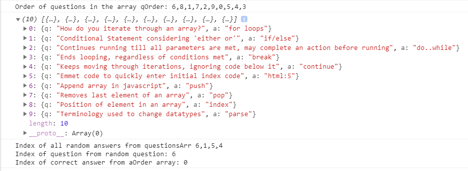

# Quiz Generator

## **The Quiz Generator**
The quiz generator is a fun way to check simple coding concepts in a form of a quiz! It meets all requirements of that the user has specified, with several possible improvements that can easily be added because of the how portable the functions are. The re-usability of the quiz generator makes it so memorization will not help you, unless you memorize the concepts!

- Prompts the user to either start quiz on coding concepts or view high scores. 

- You can view the high scores from the initial prompt. Looks like AJ doesn't know his basic coding concepts. Lets see if we can beat him!

- Pressing the back button resets all the values to their initial values, and removes the display, giving room for the container to take up its space.

- When the quiz starts, a timer will countdown from 100 and deduct 10 points. 10 points are calculated by timeleft-=9 + the 1 second it takes to update the timer. 

- Starting quizzes again will always randomize the order of the question, as well as the order of the answers. The answers are also dynamically selected from an object. An index is checked to determine that the real answer does exist within the set of answer choices.

- When the user enters a correct password, the background changes to green and the question will change within 2 seconds. The timer will be paused while they wait for the question to change. Their score increments by 1 point.

- When the user enters an incorrect password, the background changes to red and the question will change within 2 seconds. The timer will be paused while they wait for the question to change. The time will decrement by 9 seconds point.

- Looks like we got a perfect score! When the quiz ends, we can enter our initials and submit it to view the high scores!

- We can view our scores in the high scores table. It will display all scores every calculated locally on the system. 

- Pressing the back button will bring us to the main page to start another quiz or view the highscores

- We finally appear on the View Scores!

- To understand the random generation logic, we first make an array of random question indices from our question object. Then as the the quiz progresses, an array of random answer indices are formulated. Checking the index of the random answer against the index of the index of the question order, we can match the value to return the correct index value within our random answer array. If the index of the correct answer did not exist, we would return a -1.

- Saving our score in local storage and retrieving it is one thing. Dynamically displaying it in a highscore generator is a whole different animal! Making sure to remove child elements of the list, we must account for every saved HighScore and remove the child element of each type of element. In this case, we have 2 elements per tree traversal, so requiring 2 calls to remove per layer. 

# Why it Matters?
Creating a quiz generator that is usable for future projects is extremely important in understanding how to create portable software. Given the structure of how the code is written, it can easily implement CSV/TSV uploads to create a true quiz generator. Allowing users the freedom to make their own question bank and answers in Excel, gives the program much more reusability for the user. The random quesiton/answer dynamic makes the program all the more challenging requiring memorization of the concepts as opposed to question order and answer positions. Other implementable ideas are a sorted score list, and user made quizzes saved on local storage for the user to revisit and attempt without re-uploading the CSV/TSV.

Visit my quiz generator [by clicking here](https://brobro10000.github.io/quiz-generator) or follow the direct link at [https://brobro10000.github.io/quiz-generator](https://brobro10000.github.io/quiz-generator). 

## 
We Hope to see you there!
 ##
